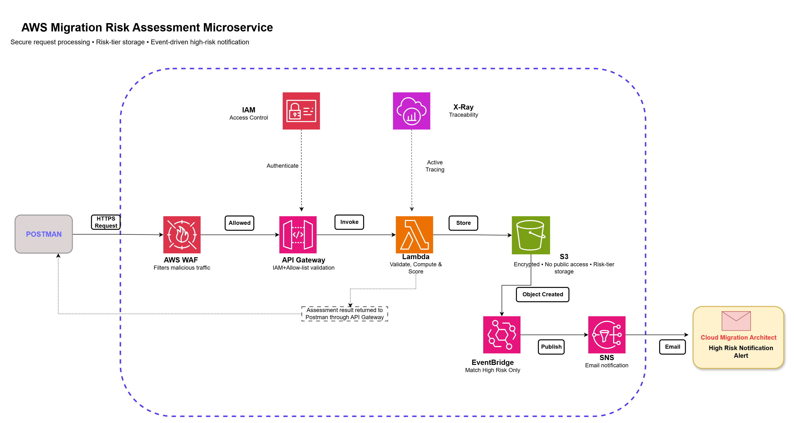

# AWS Migration Risk Assessment Microservice

A small proof of concept that scores how risky an Oracle (on-prem)-to-AWS database migration is going to be — before anyone commits to a migration plan.

## The idea

Companies moving a database out of their own data center and into AWS always ask the same question first: *"Is this going to be easy, or is it going to be a mess?"*

I was leading the migration efforts with a team of 8 DBAs and 6 off shore DBAs. 

In the first phase of migration, which is Assess ..We were collecting data and prepare MRA.
After conducting multiple meetings, discussions with stakeholders, other teams .. an idea came to me like a flash! Why can't I do a PoC of what AWS can do?
Built a small microservice to help us in this phase. 

This microservice answers that automatically. A DBA answers 8 straightforward questions about the database — size, acceptable downtime, whether it uses advanced features, whether it holds sensitive data — and gets back an instant score: **LOW**, **MEDIUM**, or **HIGH** risk.

If the result is high risk, the system automatically alerts the right person by email — no one has to remember to check, no one has to dig through a spreadsheet later.

## Architecture

**Flow:**
1. A request is sent in with the answers to the 8 questions (for initial testing we used Postman tool, later developed a portal)
2. AWS WAF inspects the request and filters out malicious traffic
3. API Gateway authenticates the caller (IAM) and checks it's coming from an approved source
4. A Lambda function validates the answers, calculates the score, and determines the risk level
5. The result — along with the original answers — is stored in S3, organized by risk level
6. If the result is high risk, an S3 event triggers EventBridge, which publishes to SNS
7. SNS emails the migration architect
8. Low and medium risk results are stored silently — no one is paged

## Security controls

| Layer | Control |
|---|---|
| Edge | AWS WAF — managed rule groups + rate limiting |
| API Gateway | IAM authentication (SigV4-signed requests) |
| API Gateway | Resource policy — restricts calls to an approved IP range |
| API Gateway | Request validation — rejects malformed input before it reaches compute |
| Lambda | Least-privilege IAM role — scoped to one S3 bucket, nothing else |
| S3 | Block Public Access + server-side encryption |
| SNS | Topic policy — only EventBridge can publish |
| Lambda + API Gateway | AWS X-Ray — full request tracing |

## AWS services used

- Amazon API Gateway
- AWS Lambda
- Amazon S3
- Amazon EventBridge
- Amazon SNS
- AWS WAF
- AWS IAM
- AWS X-Ray

## Scoring model
I recommend 8 standard questions, with exactly 3 choices per question.

That gives us:

8 questions - 3 choices each

Each of the 8 questions is answered A, B, or C:
- **A** = 0 risk points
- **B** = 5 risk points
- **C** = 10 risk points

**Proposed questionnaire**

| ID | Question | A — 0 points | B — 5 points | C — 10 points |
|---|---|---|---|---|
| Q01 | What is the Oracle database version? | 19c or newer | 12c or 18c | 11g or older |
| Q02 | What is the approximate database size? | 100 GB or less | 101–500 GB | More than 500 GB |
| Q03 | How much migration downtime is acceptable? | More than 4 hours | 1–4 hours | Less than 1 hour |
| Q04 | What is the current database architecture? | Single instance/RAC | RAC with Data Guard | RAC with Data Guard or 3rd party tools |
| Q05 | How heavily are special Oracle features used? | None or minimal | Some LOBs or materialized views | Heavy LOBs, Spatial, or advanced features |
| Q06 | How many external dependencies exist? | Few and documented | Several but documented | Many or undocumented |
| Q07 | What is the sensitive-data status? | No sensitive data | Sensitive data is encrypted; PII | Sensitive data is not encrypted |
| Q08 | How ready is the proposed AWS target? | Selected and tested | Selected but not tested | Selected but not tested |

`readinessScore = 100 - (sum of all risk points)`

| Score | Risk level | Notification |
|---:|---|---|
| 80–100 | LOW | None |
| 60–79 | MEDIUM | None |
| Below 60 | HIGH | Email to migration architect |

## Files in this repo

- `lambda_function.py` — the scoring engine
- `policies/iam_lambda_role_policy.json` — least-privilege role for Lambda
- `policies/apigw_request_validation_schema.json` — request validation schema
- `policies/apigw_resource_policy.json` — API Gateway IP allow-list
- `policies/s3_bucket_policy.json` — S3 encryption + transport policy
- `policies/eventbridge_rule_pattern.json` — the high-risk-only event filter
- `policies/sns_topic_policy.json` — restricts SNS publishing to EventBridge

## What this is (and isn't)

This is a proof of concept demonstrating a secure, event-driven serverless pattern on AWS — not a production migration tool. It assesses *readiness*; it doesn't execute the migration itself.

**Possible next step:** a reporting layer (e.g. a small dashboard or Amazon QuickSight) so migration leads can see trends across all assessments, not just get an email per high-risk finding.
